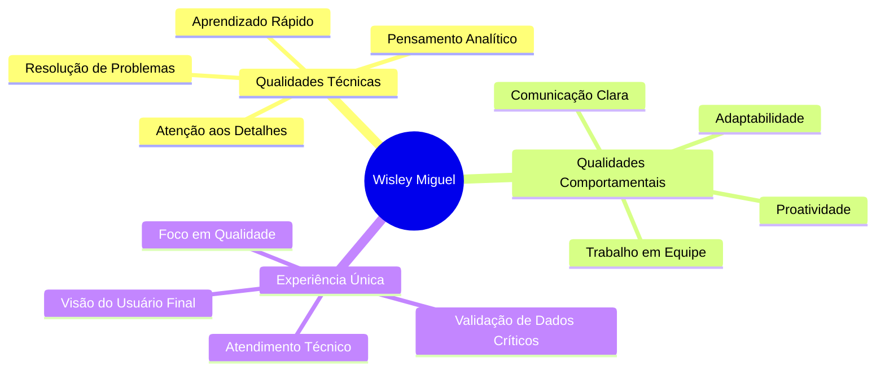
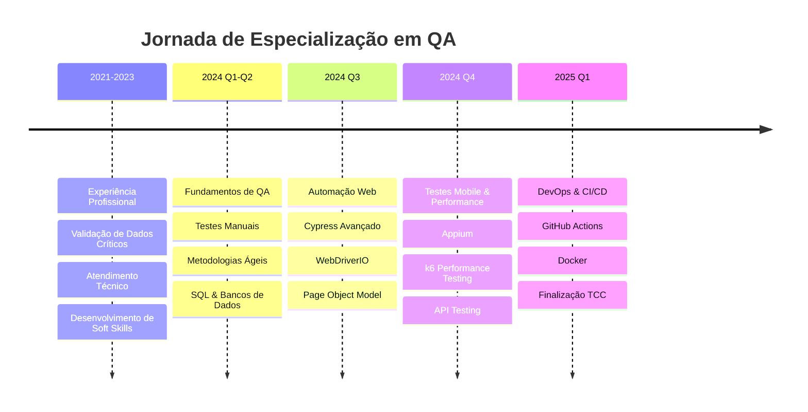

<div align="center">
  
[](https://git.io/typing-svg)

<p>
  <a href="https://www.linkedin.com/in/wisley-miguel/" target="_blank">
    
  </a>
  <a href="mailto:wisleymiguel0@gmail.com">
    
  </a>
  <a href="https://wa.me/5531971023359" target="_blank">
    
  </a>
  <a href="https://github.com/Wisleymiguel" target="_blank">
    
  </a>
</p>


</div>

---

## 👨‍💻 Sobre Mim

```javascript
const wisley = {
    localização: "Belo Horizonte - MG, Brasil 🇧🇷",
    modalidade: "Remoto | Híbrido | Presencial",
    idade: 22,
    formação: "Engenharia de Qualidade de Software - EBAC (98% concluído)",
    conclusão: "Janeiro/2026",
    
    experiênciaProfissional: {
        anos: 3,
        área: "Validação de Dados Críticos & Atendimento Técnico",
        transição: "Quality Assurance Engineer"
    },
    
    missão: "Garantir excelência em software através de testes rigorosos",
    visão: "Tornar-me referência em automação e qualidade de software",
    valores: ["Precisão", "Aprendizado Contínuo", "Foco no Usuário"]
};
```

<details>
<summary>🎯 <b>Minha Jornada para QA</b> (clique para expandir)</summary>
<br>

Durante 3 anos validando dados críticos que impactavam diretamente clientes finais, desenvolvi algo especial: **a capacidade de enxergar o que outros não veem**. Era sempre eu quem encontrava as inconsistências, os padrões ocultos, os detalhes que faziam diferença.

Essa percepção me levou a uma descoberta importante: minhas competências naturais (atenção microscópica aos detalhes, pensamento analítico estruturado e empatia com o usuário final) se alinhavam perfeitamente com Quality Assurance.

**O que me move:**
- 🔍 Transformar complexidade em clareza
- 🛡️ Ser a última linha de defesa entre bugs e usuários
- 🚀 Evoluir constantemente através da tecnologia
- 💡 Aplicar pensamento crítico para prevenir problemas

</details>

---

## 🎓 Formação & Certificações

<div align="center">

| 🏆 Certificação | 🏢 Instituição | 📅 Status | 🔗 Verificação |
|:---------------:|:--------------:|:---------:|:--------------:|
| **Engenharia de Qualidade de Software** | EBAC | 98% Concluído ✅ | Jan/2026 |
| **Automação de Testes E2E** | EBAC | Concluído ✅ | 2024 |
| **Performance Testing** | EBAC | Concluído ✅ | 2024 |
| **Mobile Testing** | EBAC | Concluído ✅ | 2024 |
| **API Testing** | EBAC | Concluído ✅ | 2024 |

</div>

---

## 💼 Competências Técnicas

<details open>
<summary><b>🤖 Automação de Testes</b></summary>
<br>

**Frameworks & Ferramentas:**


**Experiência:**
- ✅ Testes E2E para aplicações web complexas
- ✅ Automação de fluxos críticos de negócio
- ✅ Page Object Model (POM) e boas práticas
- ✅ Integração com CI/CD pipelines
- ✅ Geração de relatórios automatizados (Allure, Mochawesome)

</details>

<details open>
<summary><b>📱 Testes Mobile</b></summary>
<br>

**Plataformas & Ferramentas:**


**Experiência:**
- ✅ Testes em emuladores e dispositivos reais
- ✅ Automação Android com WebDriverIO + Appium
- ✅ Testes de compatibilidade entre versões
- ✅ Validação de UX/UI mobile

</details>

<details open>
<summary><b>⚡ Performance & API Testing</b></summary>
<br>

**Ferramentas:**


**Experiência:**
- ✅ Testes de carga e stress com k6
- ✅ Análise de métricas (latência, throughput, tempo de resposta)
- ✅ Identificação de gargalos de performance
- ✅ Testes de APIs REST com Postman e Cypress
- ✅ Validação de contratos de API

</details>

<details open>
<summary><b>🔧 DevOps & CI/CD</b></summary>
<br>

**Ferramentas:**


**Experiência:**
- ✅ Configuração de pipelines de testes automatizados
- ✅ Integração contínua com GitHub Actions
- ✅ Versionamento de código e colaboração (Git/GitHub)
- ✅ Containerização de ambientes de teste

</details>

<details open>
<summary><b>💾 Banco de Dados & Backend</b></summary>
<br>

**Tecnologias:**


**Experiência:**
- ✅ Queries SQL para validação de dados
- ✅ Testes de integridade de banco de dados
- ✅ Validação de migrações e schemas

</details>

<details open>
<summary><b>💻 Linguagens de Programação</b></summary>
<br>


**Nível de Proficiência:**
- JavaScript: ⭐⭐⭐⭐☆ (Avançado)
- Python: ⭐⭐⭐☆☆ (Intermediário)
- SQL: ⭐⭐⭐☆☆ (Intermediário)

</details>

---

## 🎯 Soft Skills & Diferenciais

<div align="center">



</div>

<table align="center">
<tr>
<td width="50%" valign="top">

### 🎯 **Competências Comportamentais**

- **🔍 Atenção aos Detalhes Microscópica**
  - Desenvolvi através de 3 anos validando dados críticos
  - Capacidade de identificar inconsistências imperceptíveis
  
- **🧠 Pensamento Analítico Estruturado**
  - Abordagem metodológica para resolução de problemas
  - Capacidade de antecipar cenários de falha
  
- **👥 Visão Centrada no Usuário**
  - Experiência em atendimento técnico
  - Compreensão profunda do impacto de bugs na UX

</td>
<td width="50%" valign="top">

### 🚀 **Diferenciais Competitivos**

- **📚 Aprendizado Autodidata Acelerado**
  - Portfólio construído por iniciativa própria
  - Constante atualização em novas tecnologias
  
- **🎯 Proatividade & Ownership**
  - Assumo responsabilidade pelos resultados
  - Busco sempre melhorias contínuas
  
- **💡 Adaptabilidade & Resiliência**
  - Rápida adaptação a novas ferramentas
  - Persistência diante de desafios complexos

</td>
</tr>
</table>

---

## 📊 Estatísticas do GitHub

<div align="center">
  
  
</div>

<div align="center">
  
</div>

<div align="center">
  
</div>

---

## 🏆 Conquistas & Troféus GitHub

<div align="center">
  
</div>

---

## 📂 Portfólio de Projetos

<div align="center">

### 🌟 **Projetos em Destaque**

</div>

<details>
<summary><b>🔄 Automação E2E com Cypress</b> - Sistema de Cadastro de Usuários</summary>
<br>

[](https://github.com/Wisleymiguel/Exerc-cio-e2e)

**📝 Descrição:**
Projeto completo de automação de testes end-to-end para validação de fluxos críticos em sistema de cadastro de usuários, incluindo validações de campos, mensagens de erro e fluxos completos.

**🛠️ Tecnologias Utilizadas:**
- Cypress
- JavaScript
- Mochawesome (Reports)
- GitHub Actions (CI)

**🎯 Principais Funcionalidades:**
- ✅ Automação de formulários complexos
- ✅ Validação de regras de negócio
- ✅ Testes de cenários positivos e negativos
- ✅ Geração de relatórios HTML
- ✅ Pipeline CI/CD automatizado

**📚 Aprendizados:**
- Implementação de Page Object Model
- Criação de comandos customizados
- Estratégias de espera e sincronização
- Documentação técnica de bugs

</details>

<details>
<summary><b>⚡ Performance Testing com k6</b> - Testes de Carga em APIs</summary>
<br>

[](https://github.com/Wisleymiguel/k6-EBAC)

**📝 Descrição:**
Análise abrangente de performance e estabilidade de APIs REST através de testes de carga, stress e spike, com foco em identificação de gargalos e limites do sistema.

**🛠️ Tecnologias Utilizadas:**
- k6 (Grafana Labs)
- JavaScript
- REST APIs
- InfluxDB (métricas)

**🎯 Principais Funcionalidades:**
- ✅ Testes de carga progressiva
- ✅ Análise de latência e throughput
- ✅ Identificação de pontos de quebra
- ✅ Relatórios detalhados de performance
- ✅ Testes de stress e spike

**📚 Aprendizados:**
- Análise de métricas de performance
- Interpretação de resultados
- Identificação de bottlenecks
- Otimização de requisições

**📊 Métricas Analisadas:**
- Response Time (p95, p99)
- Requests per Second (RPS)
- Error Rate
- Throughput

</details>

<details>
<summary><b>📱 Automação Mobile</b> - Testes Android com WebDriverIO + Appium</summary>
<br>

[](https://github.com/Wisleymiguel/teste-Android-Studio)

**📝 Descrição:**
Projeto de automação de testes para aplicativo Android nativo, cobrindo funcionalidades críticas e validações de UX mobile com integração de relatórios visuais.

**🛠️ Tecnologias Utilizadas:**
- WebDriverIO
- Appium
- Android Studio (Emulator)
- Allure Reports
- JavaScript

**🎯 Principais Funcionalidades:**
- ✅ Automação de gestos mobile (tap, swipe, scroll)
- ✅ Testes em múltiplas resoluções
- ✅ Validação de elementos nativos
- ✅ Screenshots automáticos em falhas
- ✅ Relatórios com evidências visuais

**📚 Aprendizados:**
- Configuração de ambiente Appium
- Locators específicos para mobile
- Estratégias de sincronização mobile
- Debug de testes em emuladores

</details>

<details>
<summary><b>🔍 Análise de Qualidade</b> - App Mundo Invest (Testes Exploratórios)</summary>
<br>

[](https://1drv.ms/w/c/34ff579c5a3939c2/EekC99lAJ8xJkXpnKcCno1MB2KDYG-AkjZtTfQdDr8aniA?e=LSeuut)

**📝 Descrição:**
Análise completa de qualidade de aplicativo financeiro através de testes exploratórios estruturados, com foco em usabilidade, segurança e experiência do usuário.

**🛠️ Metodologias Aplicadas:**
- Testes Exploratórios
- Análise Heurística de Usabilidade
- Session-Based Test Management
- Bug Report Writing

**🎯 Principais Entregas:**
- ✅ Documentação de 15+ bugs críticos
- ✅ Análise de fluxos de negócio
- ✅ Recomendações de UX/UI
- ✅ Matriz de priorização de bugs
- ✅ Relatório executivo de qualidade

**📚 Aprendizados:**
- Técnicas de teste exploratório
- Documentação profissional de bugs
- Análise de impacto no negócio
- Comunicação com stakeholders

**🎨 Categorias Analisadas:**
- Funcionalidade
- Usabilidade
- Performance
- Segurança
- Acessibilidade

</details>

<details>
<summary><b>💻 Testes Unitários</b> - JavaScript com TDD</summary>
<br>

[](https://github.com/Wisleymiguel/Teste-Java-script)

**📝 Descrição:**
Implementação de funções JavaScript seguindo metodologia TDD (Test-Driven Development), com foco em cobertura de código e qualidade de software desde a concepção.

**🛠️ Tecnologias Utilizadas:**
- JavaScript (ES6+)
- Jest / Mocha
- TDD Methodology
- Code Coverage Tools

**🎯 Principais Funcionalidades:**
- ✅ Testes unitários com alta cobertura
- ✅ Aplicação de TDD
- ✅ Refatoração guiada por testes
- ✅ Mocks e Stubs
- ✅ Assertions complexas

**📚 Aprendizados:**
- Metodologia TDD na prática
- Escrita de código testável
- Padrões de teste unitário
- Análise de cobertura de código

</details>

---

## 🎓 Linha do Tempo de Aprendizado



---

## 🎯 Objetivos e Metas

<table>
<tr>
<td width="33%" align="center">

### 🎯 **Curto Prazo**
*Jan - Jun 2025*

- ✅ Concluir TCC (Jan/2025)
- 🎯 Primeira posição como QA
- 📚 Certificação ISTQB
- 🔧 Dominar Selenium

</td>
<td width="33%" align="center">

### 🚀 **Médio Prazo**
*2025 - 2026*

- 📱 Especialização Mobile
- ☁️ Cloud Testing (AWS/Azure)
- 🤖 IA aplicada a Testes
- 👥 Mentorar iniciantes

</td>
<td width="33%" align="center">

### 🏆 **Longo Prazo**
*2026+*

- 🎓 QA Lead/Manager
- 🌟 Palestrante em eventos
- 📝 Contribuir Open Source
- 🏢 Referência em QA

</td>
</tr>
</table>

---

## 📈 Conhecimentos em Desenvolvimento

<div align="center">

| Tecnologia | Nível de Conhecimento | Próximos Passos |
|:----------:|:---------------------:|:---------------:|
| **Cypress** |  | Testes de componentes |
| **WebDriverIO** |  | Cross-browser testing |
| **k6** |  | Testes distribuídos |
| **Appium** |  | iOS automation |
| **Docker** |  | Kubernetes |
| **Python** |  | Pytest framework |
| **Selenium** |  | Grid setup |
| **Jenkins** |  | Pipeline avançado |

</div>

---

## 💡 Filosofia de Trabalho

<div align="center">

> ### 💭 *"Qualidade não é um acidente, é sempre o resultado de um esforço inteligente."*
> **— John Ruskin**

</div>

<table>
<tr>
<td width="50%">

### 🎯 **Minha Abordagem em QA:**

```python
def minha_filosofia_qa():
    principios = {
        "Prevenção": "Bugs não encontrados > Bugs corrigidos",
        "Empatia": "Pensar como usuário final sempre",
        "Comunicação": "Bugs claros = Correções rápidas",
        "Evolução": "Aprender com cada falha encontrada",
        "Colaboração": "QA é responsabilidade de todos"
    }
    
    for principio, valor in principios.items():
        implementar(principio, valor)
    
    return "Software de Excelência"
```

</td>
<td width="50%">

### 🔥 **Meu Compromisso:**

- 🛡️ **Defender o Usuário**
  - Ser a voz de quem usa o produto
  
- 🔍 **Buscar Perfeição**
  - Não apenas encontrar bugs, mas prevenir
  
- 📚 **Nunca Parar de Aprender**
  - Tecnologia evolui, eu evoluo junto
  
- 🤝 **Colaborar Sempre**
  - Qualidade é trabalho de equipe
  
- 💡 **Inovar Constantemente**
  - Buscar formas melhores de testar

</td>
</tr>
</table>

---

## 🌟 O Que Me Diferencia

<div align="center">

```ascii
╔═══════════════════════════════════════════════════════════════════════════╗
║                                                                           ║
║  🎯 VISÃO DE NEGÓCIO + 🔧 EXPERTISE TÉCNICA + 👥 FOCO NO USUÁRIO         ║
║                                                                           ║
║  = Profissional QA que entende o IMPACTO de cada bug                    ║
║                                                                           ║
╚═══════════════════════════════════════════════════════════════════════════╝
```

</div>

**Por que me escolher?**

1. **🔍 Atenção aos Detalhes que Outros Não Veem**
   - 3 anos identificando inconsistências em dados críticos
   - Habilidade natural de encontrar o que está "fora do lugar"

2. **🎓 Formação Estruturada + Prática Intensiva**
   - Não apenas cursos, mas projetos reais no portfólio
   - Aprendizado guiado por problemas reais do mercado

3. **👤 Experiência com Usuário Final**
   - Entendo profundamente o impacto de bugs na experiência
   - Sei priorizar o que realmente importa para o negócio

4. **🚀 Proatividade & Autodidatismo**
   - Não espero ser ensinado, eu busco aprender
   - Portfólio construído por pura determinação

5. **💬 Comunicação Clara & Documentação Precisa**
   - Reports de bugs que facilitam correção rápida
   - Capacidade de traduzir técnico para não-técnico

---

## 📞 Vamos Conversar?

<div align="center">

### 🚀 **Aberto a Oportunidades**

Estou em busca da minha primeira oportunidade como **Analista de QA / Engenheiro de Qualidade de Software** para aplicar minhas competências técnicas e comportamentais em um ambiente profissional desafiador.

**Modalidades:** Remoto | Híbrido | Presencial em Belo Horizonte-MG

<br>

<a href="https://www.linkedin.com/in/wisley-miguel/" target="_blank">
  
</a>
<a href="mailto:wisleymiguel0@gmail.com">
  
</a>
<a href="https://wa.me/5531971023359" target="_blank">
  
</a>

<br><br>

### 📊 **Disponibilidade Imediata**

```javascript
const disponibilidade = {
    horário: "Período Integral",
    modalidade: ["Remoto", "Híbrido", "Presencial"],
    localização: "Belo Horizonte - MG",
    início: "Imediato",
    mobilidade: "Sim, para BH e região metropolitana"
};
```

<br>

### 💼 **Áreas de Interesse**

`Quality Assurance` • `Test Automation` • `Performance Testing` • `Mobile Testing` • `API Testing` • `CI/CD` • `Agile Testing`

<br>

---

<sub>⚡ **Curiosidade:** Este README foi criado com muito carinho e atenção aos detalhes — exatamente como eu abordo cada teste que realizo!</sub>

</div>


<div align="center">
  
**⭐ Se você chegou até aqui, deixe uma estrela no repositório! ⭐**

[](https://github.com/Wisleymiguel)


*Última atualização: Janeiro 2025*

</div>
